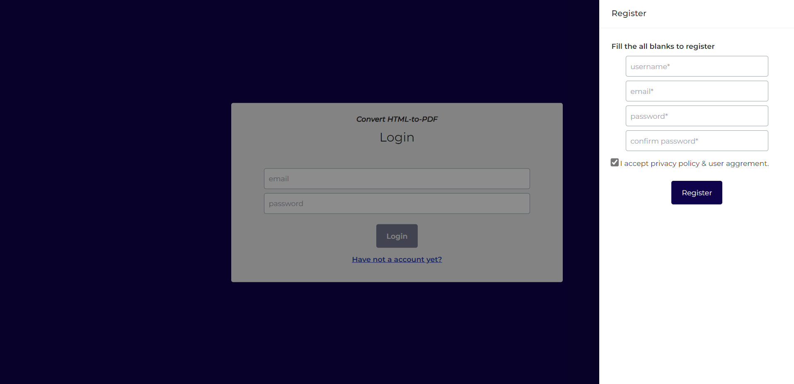
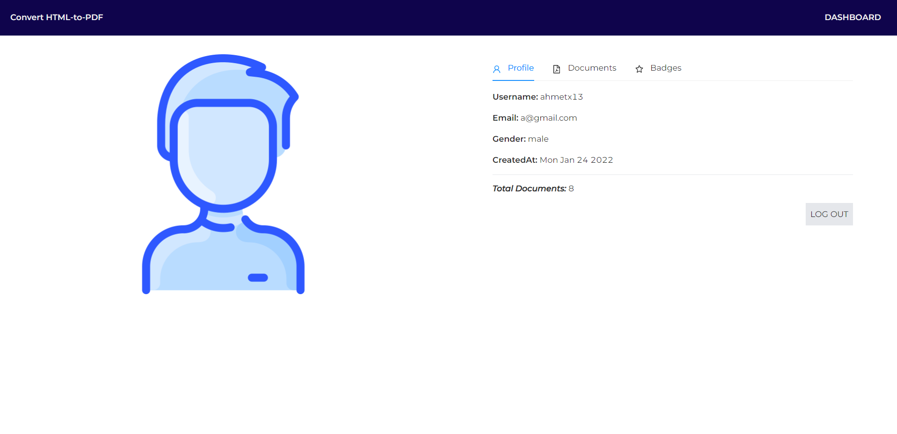
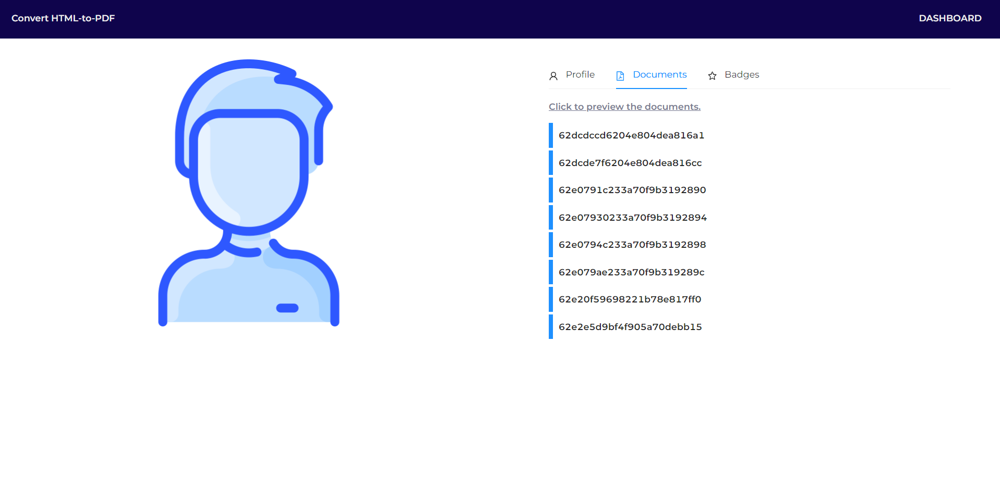
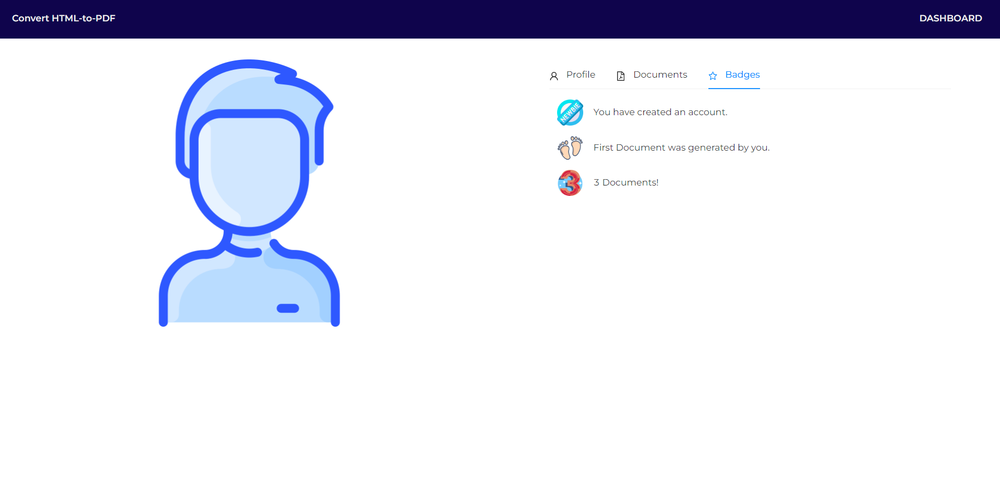
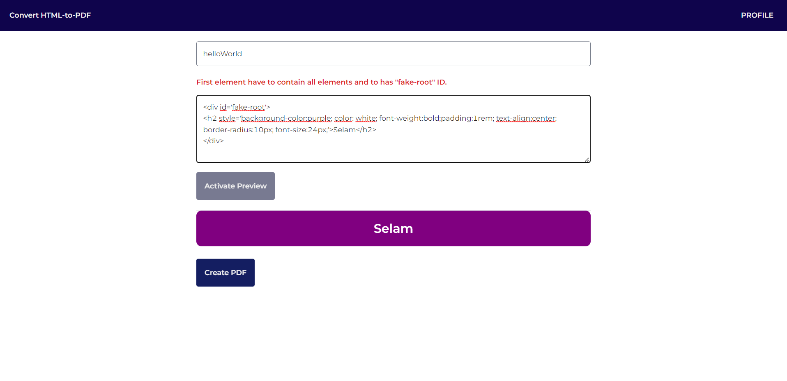

## Get Started

* Enter the directory, run 'npm install'. It will run locally.
 
# DB

### Models
Database have 2 models; User & Document. there is one-to-many relationship between these models.

# Backend

### API
Let's examine API as two different titles. User Auth, Document Operations.

### *User Auth*
|   Functions	|  Auth Middleware 	|  Descriptions 	|
|:---	        |        :---:  	|              ---:	|
|   register	| ❌ |   Register in the system	|
|   login   	| ❌ |   Login. The System will create token & cookie for your security	|
|   loggedin	| ❌ |That method is for client-side. It return response value that if user is still in system or not|
|   logout	    | ❌ |   logout function clears token cookies.	|

### *Document Operations*
|   Functions	|  Auth Middleware 	|  
|:---	        |        ---:  	|
|   createDoc  	| ✅ |
|   getUser  	| ✅ |
|   getDoc	| ✅ |

# Frontend
* Coded by React. App.js includes the routes that are default route and protectedRoutes. 
* Redux folder keep store and slice. store is activated in index.js and slice(s) are used in components. 
* Project has 3 pages. Login, Profile and profile's dashboard pages.

## Login Page
* It has Login and Register Functions.

---

## Profile Page
* It has getUser and auth Functions.

* The Documents that were created by you.

---

## Dashboard Page
* It has createDoc and auth Functions.
  

